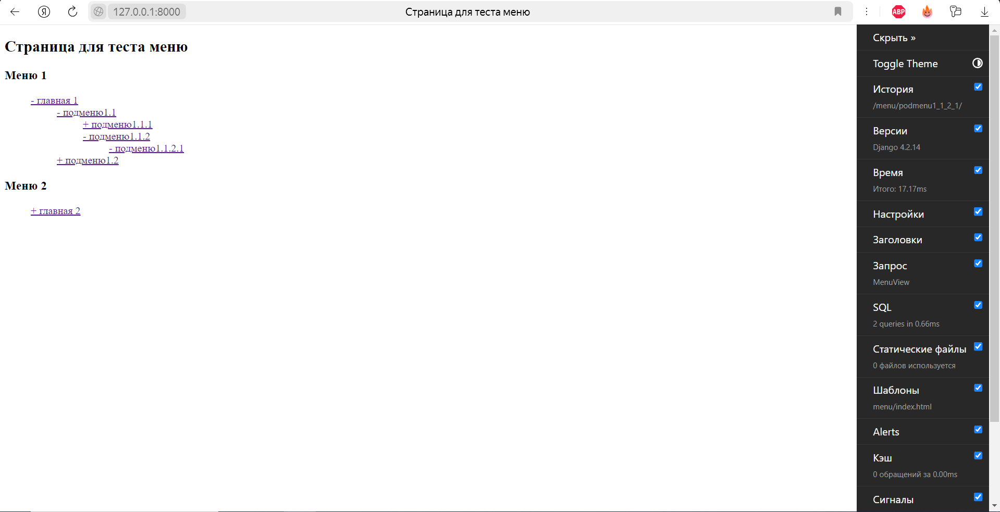

## Старт

1. Клонирование репозитория: Откройте свой терминал и перейдите в каталог, в котором вы хотите сохранить проект. Используйте git clone команду для клонирования репозитория:
```git clone <repository_url>```

2. Перейдите в каталог проекта и создайте виртуальную среду:
```cd project_folder```

3. Активировать виртуальную среду:

macOS and Linux:
```source venv/bin/activate```

Windows:
```venv\Scripts\activate```

4. Установка зависимостей: Находясь в каталоге проекта и с активированной виртуальной средой, используйте pip для установки зависимостей проекта, перечисленных в requirements.txt файле:
```pip install -r requirements.txt```

5. Настройте файл .env

6. Запустите команды миграции для создания схемы базы данных:
```python manage.py migrate```

7. Запустите сервер разработки: Запустите сервер разработки Django, используя следующую команду:
```python manage.py runserver```

8. Откройте веб-браузер и перейдите по ссылке http://127.0.0.1:8000/ чтобы получить доступ к вашему проекту Django.

## Описание

Древовидное меню реализовано в приложении menu. Две таблицы: Menu и MenuElement.
Из внешних библиотек использованы: python-dotenv(использование env файла) и django-debug-toolbar(для отслеживания количества запросов к БД). 
Эти библиотеки никак не влияют на саму реализацию. Меню находится по пути 'menu/', админ панель по пути 'admin/'.




Для отрисовки двух меню было выполнено 2 sql запроса:


Выполнение одного sql запроса на одно меню было реализовано благодаря получению всего списка элементов относящихся к определенному меню. Затем же этот список конвертировался в иерархическую структуру для дальнейшего отображения.

## Работа в админ-панели. 
Для начала добавьте запись о меню.


Затем добавьте главный элемент меню и рекурсивно добавляйте подменю. Для каждого элемента необходимо указывать текст, slug(по какой ссылке находится), к какому меню он относится, и необязательно поле родитель(указывается для всех кроме самого верхнего элемента).
